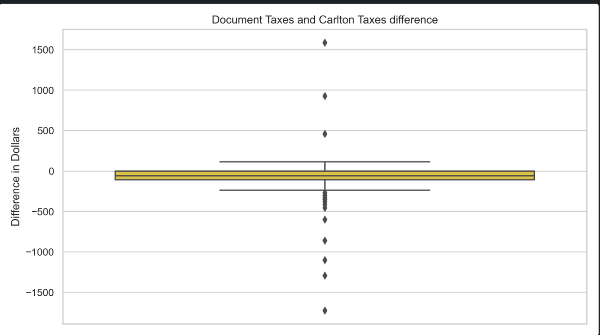
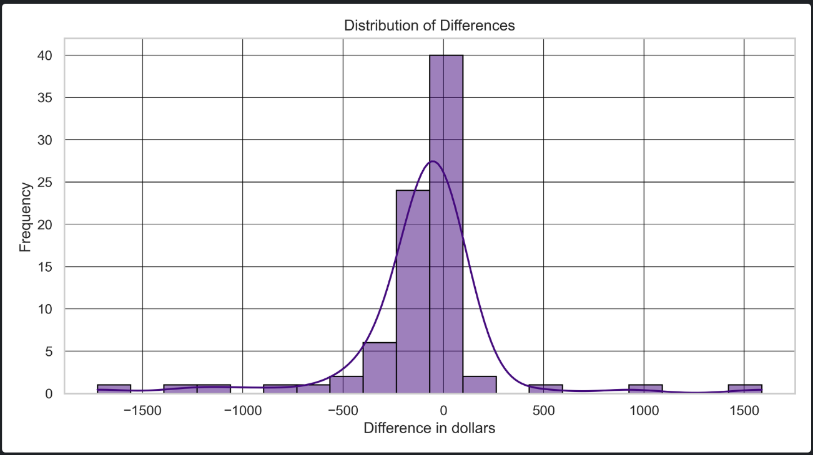

# Analyzing Carlton’s Tax and Fee Calculations

## Objective
This project analyzed the accuracy of Carlton’s tax and fee estimations by comparing them against itemized DMV data extracted using OCR from scanned documents. The analysis was requested by the business to evaluate whether Carlton’s tax estimation services are accurate and reliable enough to be utilized for calculating taxes and fees for dealers and applicants. Key findings from this analysis provided critical insights into discrepancies, patterns, and potential mismatches between Carlton’s estimates and DMV-reported values.

---

## Background
Accurate estimation of taxes and fees is essential for automotive dealerships and applicants when processing financial transactions. Carlton provides tax and fee estimation services, but their reliability needed to be assessed by comparing them against DMV-reported data for a set of deals.

### Key Steps:
- Tax and fee estimations were retrieved from Carlton's RawXML field.
- DMV tax and fee data were extracted using OCR from document scans (e.g., lien receipts,RIC).
- Both datasets were compared to identify discrepancies and assess the overall accuracy of Carlton’s estimates.

---

## Approach

### Data Collection
- **Carlton Data**: Extracted estimated tax and fee values for each application from the RawXML field in Carlton’s dataset.
- **DMV Data**: Retrieved lien receipts or RICs from the DMV using the Nautilus API and processed these scanned documents with OCR to extract itemized tax and fee details.
- **Document Validation**: Filtered out improperly classified documents to ensure only valid tax receipts were included in the analysis.

### Data Analysis
1. **Fee Comparison**:
   - Calculated the total fees estimated by Carlton and those reported by the DMV for each application.
   - Analyzed the differences, including average, maximum, and minimum discrepancies.

2. **Tax Comparison**:
   - Calculated total taxes charged by the DMV using itemized tax receipts.
   - For Carlton, computed tax amounts by applying the estimated percentage to the vehicle price.
   - Compared Carlton’s computed tax values to DMV-reported taxes.

3. **Statistical Analysis**:
   - Identified key metrics, including average, maximum, and minimum discrepancies.
   - Highlighted patterns and outliers using visualizations such as box plots and histograms.

---

## Results

### Fees
- **Average Difference**: DMV fees were higher than Carlton’s estimates by an average of **$210.10**.
- **Maximum Difference**: The largest discrepancy was **$847.75**, where DMV fees significantly exceeded Carlton’s estimates.
- **Minimum Difference**: The smallest difference observed was **$5**, where Carlton's estimate was slightly higher than the DMV fee.
- **Maximum Fees**:
  - Carlton: **$644**.
  - DMV: **$1092**.

### Taxes
- **Average Difference**: Carlton taxes exceeded DMV taxes by an average of **$100.61**.
- **Maximum Difference**: Carlton’s tax values were higher than DMV taxes by **$1724.63** at most.
- **Minimum Difference**: A difference of **$0** was observed in 4 cases.
- **Maximum Taxes**:
  - Carlton: **$2169.64**.
  - DMV: **$2069.90**.

---

## Visualizations

### Box Plot Observation:
- Differences in tax values were tightly packed for most cases but showed several outliers with large discrepancies.
- Carlton’s percentage-based tax calculation, which relies on the vehicle price, may have contributed to these outliers if a different price was used.

### Histogram Observation:
- Most differences clustered into two specific ranges (~80% of the data fell into these bins).
- **Extreme outliers** were observed, potentially due to Carlton using a different vehicle price for tax estimation compared to the DMV documents.

---

## Insights

### Fee Analysis
- Carlton consistently underestimated DMV fees, with an average discrepancy of **$210.10**.
- Large discrepancies in specific cases suggest inconsistencies in Carlton's fee estimation approach.

### Tax Analysis
- Carlton does not provide exact tax values like those found in DMV documents. Instead, it supplies a **percentage-based estimation**.
- For the comparison, the tax amount was calculated using the vehicle price from the DMV documents and Carlton’s percentage. Discrepancies may arise if Carlton used a different price for its calculations.
- **Extreme outliers** and larger discrepancies often corresponded to mismatches in vehicle price data or calculation methods between Carlton and DMV datasets.
- Carlton taxes were, on average, higher than DMV-reported taxes, primarily driven by the reliance on percentage-based calculations and mismatches in the input vehicle price.

---
## [Explore the Complete Code in Jupyter Notebook](https://github.com/srdjan-injac/carlton_tax_accuracy/blob/main/Carlton_Tax.ipynb)

## Key Technologies
- **Languages**: Python, SQL
- **Libraries**: `pandas`, `requests`, `requests`, `BeautifulSoup`, `re`, `matplotlib`, `seaborn`

---
[Back to My Portfolio](https://srdjan-injac.github.io/my_portfolio/)
